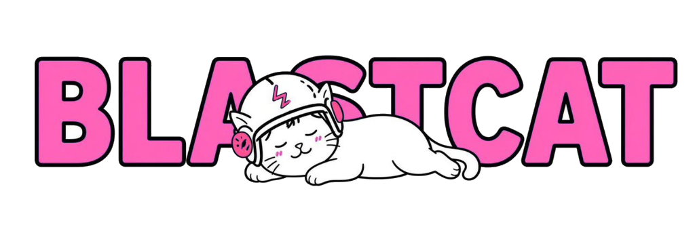

# ⚡ BlastCat ($BCAT) — First Cat on Blast.fun

Official repository for **BlastCat ($BCAT)** — the premier feline memecoin on **Blast.fun** launchpad on **Sui**.



---

## 🐱 About BlastCat
* **First Cat on Blast.fun:** The pioneer feline memecoin on Blast.fun on Sui.
* **0% Buy / 0% Sell Tax:** Pure community vibes with zero hidden fees.
* **100% Fair Launch & Automatic LP Burn:** Seamless bonding curve progression to DEX migration.
* **Total Supply:** 1,000,000,000 $BCAT.

---

## 🛠️ Tech Stack
* **Framework:** React 18 + Vite
* **Styling:** Custom Cyberpunk / Mission Control Vanilla CSS design system
* **Audio Engine:** Web Audio API sound synthesis
* **Icons & Effects:** Canvas-confetti, dynamic background electric particles

---

## 🚀 Getting Started Locally

```bash
# Clone the repository
git clone https://github.com/GeeAkpan/Blastcat.git
cd Blastcat

# Install dependencies
npm install

# Start development server
npm run dev

# Build for production
npm run build
```

---

## 📄 License
MIT License. Created by the BlastCat Community. ⚡🐱💧
